****************SMB FARM SUITE**************** 
> Done by Kimberly Mutanga

##Project Overview

This is a Python-based desktop application built to explore GUI development using Python. Initially envisioned as a commercial product, the project evolved into an educational exercise serving as a hands-on learning experience in building functional desktop software.

 While it may not follow the conventions of professional software engineering, it reflects the journey of learning, experimenting, and improving. Think of it as a "bad boy" with good intentions.

##What it does 
The SMB Farm Application is designed to help manage cattle on a small-to-medium-sized farm. Key features include:

- 📁 Save Search Results Export filtered cattle records to CSV or Excel for easy reporting and analysis.

- 📊 Health Trend Tracker Monitor herd health trends over a selected time period to identify patterns and potential issues.

- 🔍 Search & Filter Tools Quickly locate specific cattle records based on tags, health status, or vaccination history.

- 🧠 Educational Value Demonstrates how to build a GUI app using Python, with real-world agricultural data as context.

##🚧 Disclaimer
> This project is not intended to represent production-grade software. It’s a learning tool—raw, honest, and evolving. If you're here to judge code quality, you might want to lower your expectations or raise your empathy 😄.

THE IMAGES BELOW WILL SHOWCASE SOME OF THE FEATURES OF THIS APP. 

> The database design.
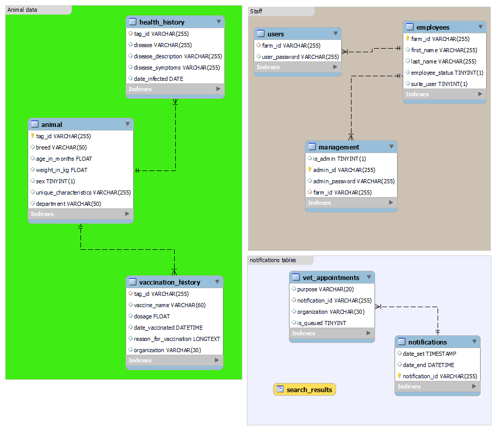

> The splash screen
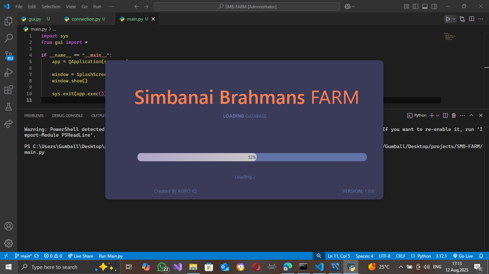

> Log in screen
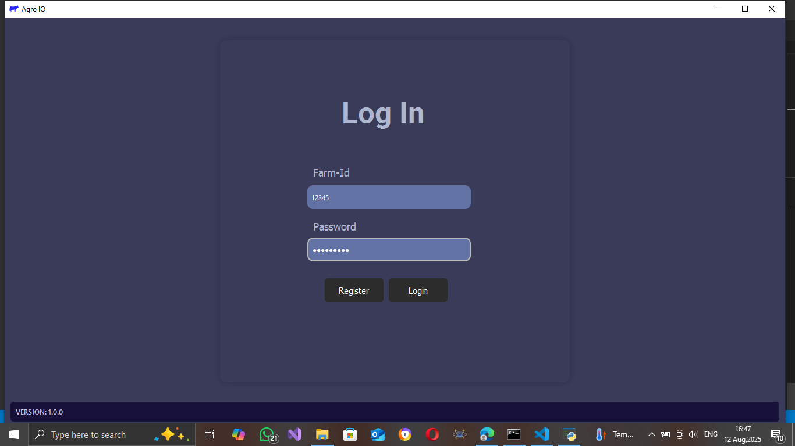

> Main page
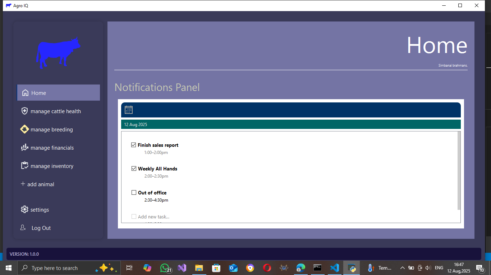

> Health History
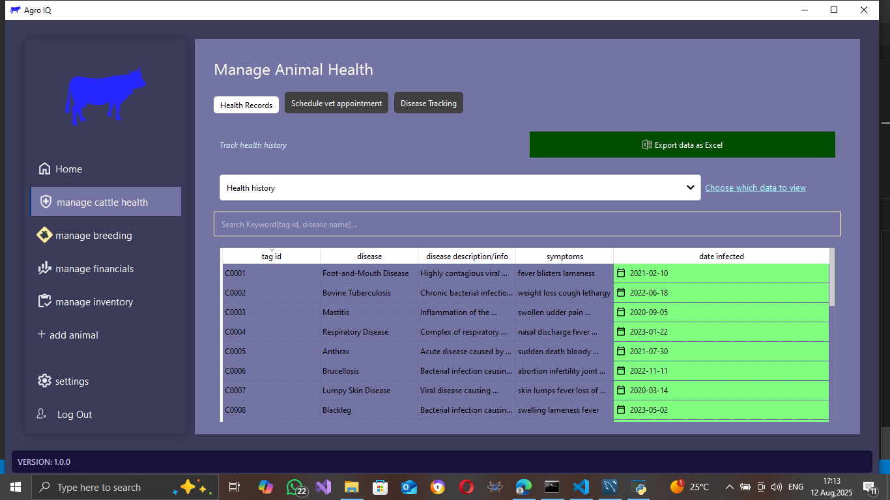

> Vaccination History
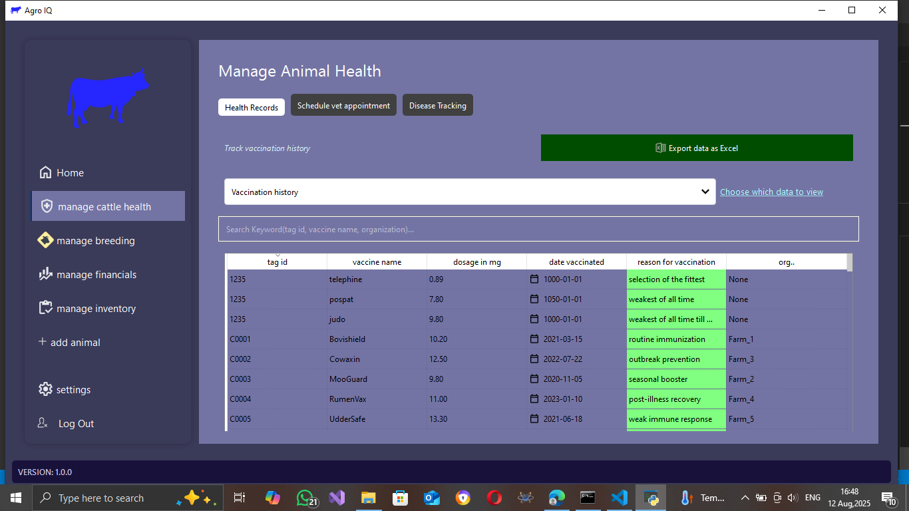

> Add vet appointments
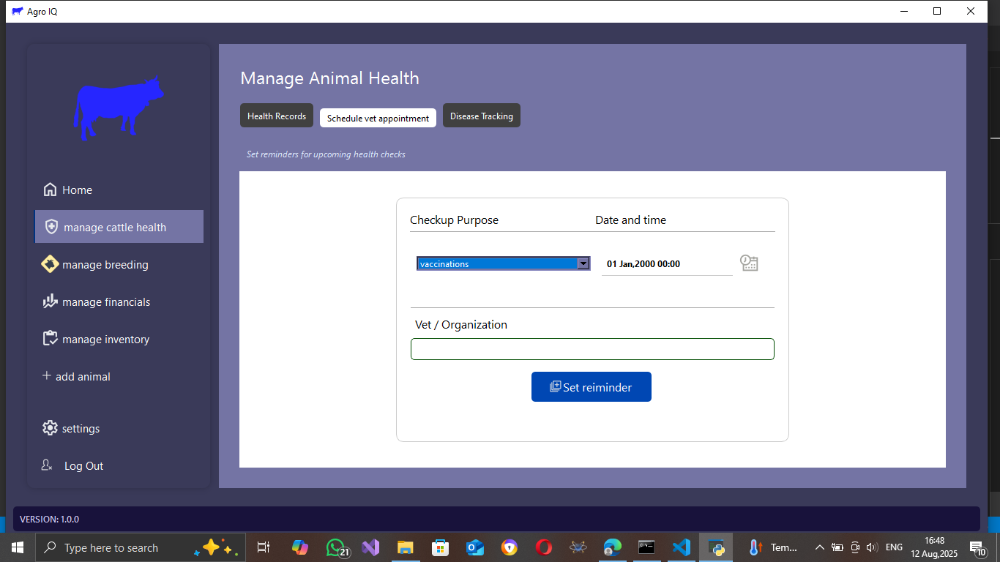

> Monitor herd health trends
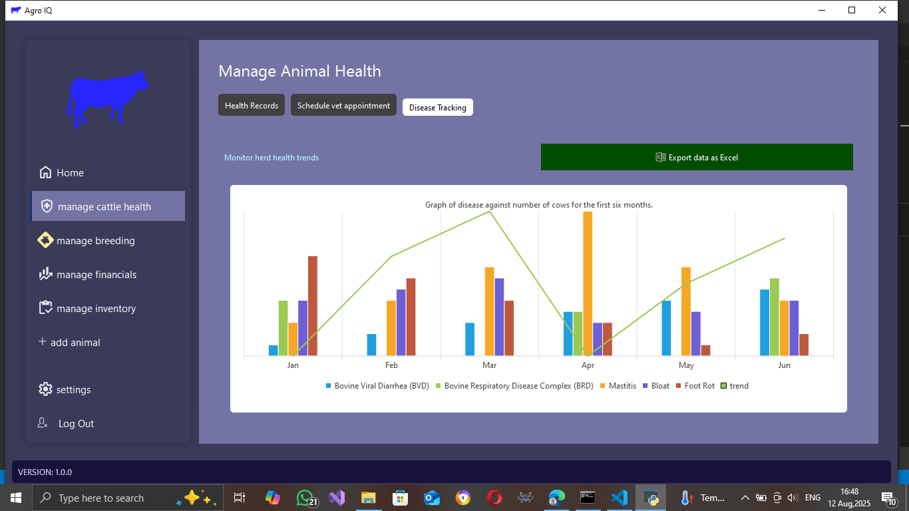

> Registration page
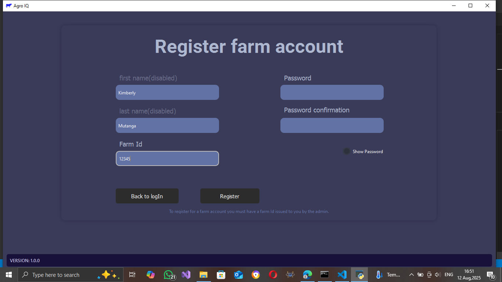

> Settings page
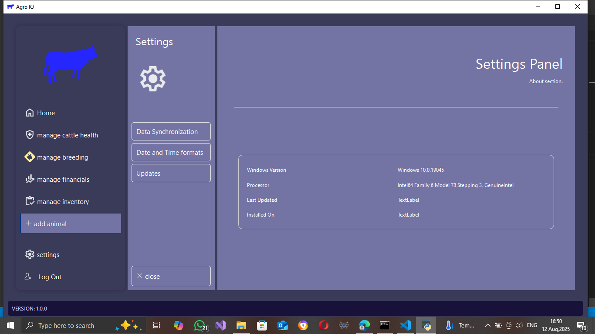

> Log Out btn highlight
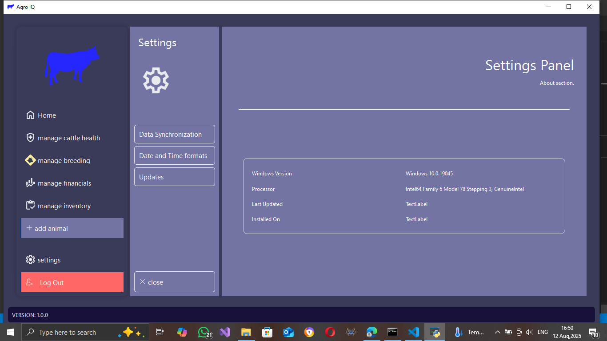

> Add Animal page
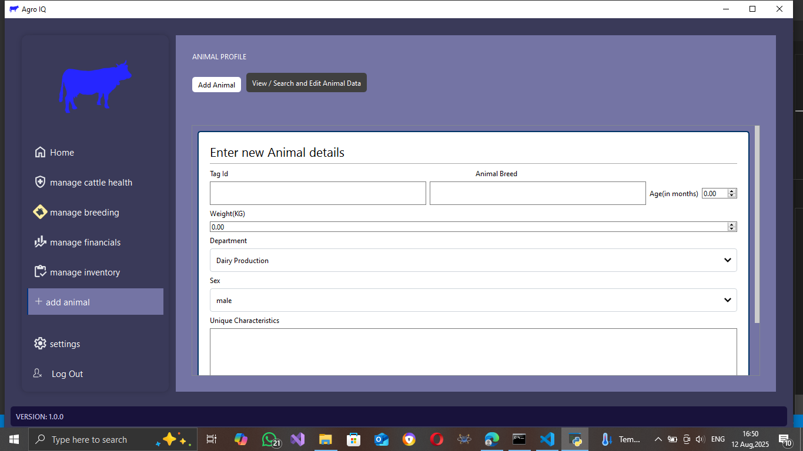

> View animal data
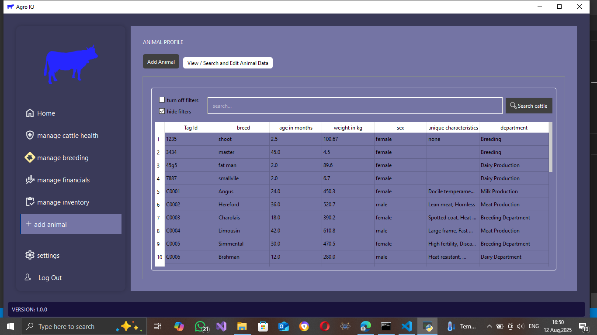

> Filters showcase
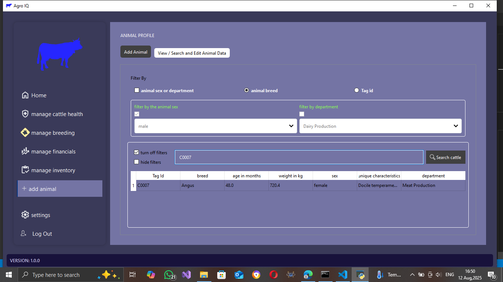
